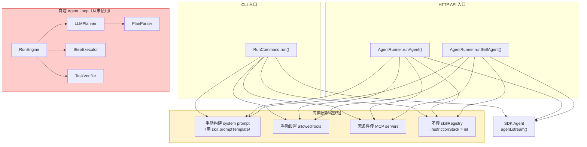
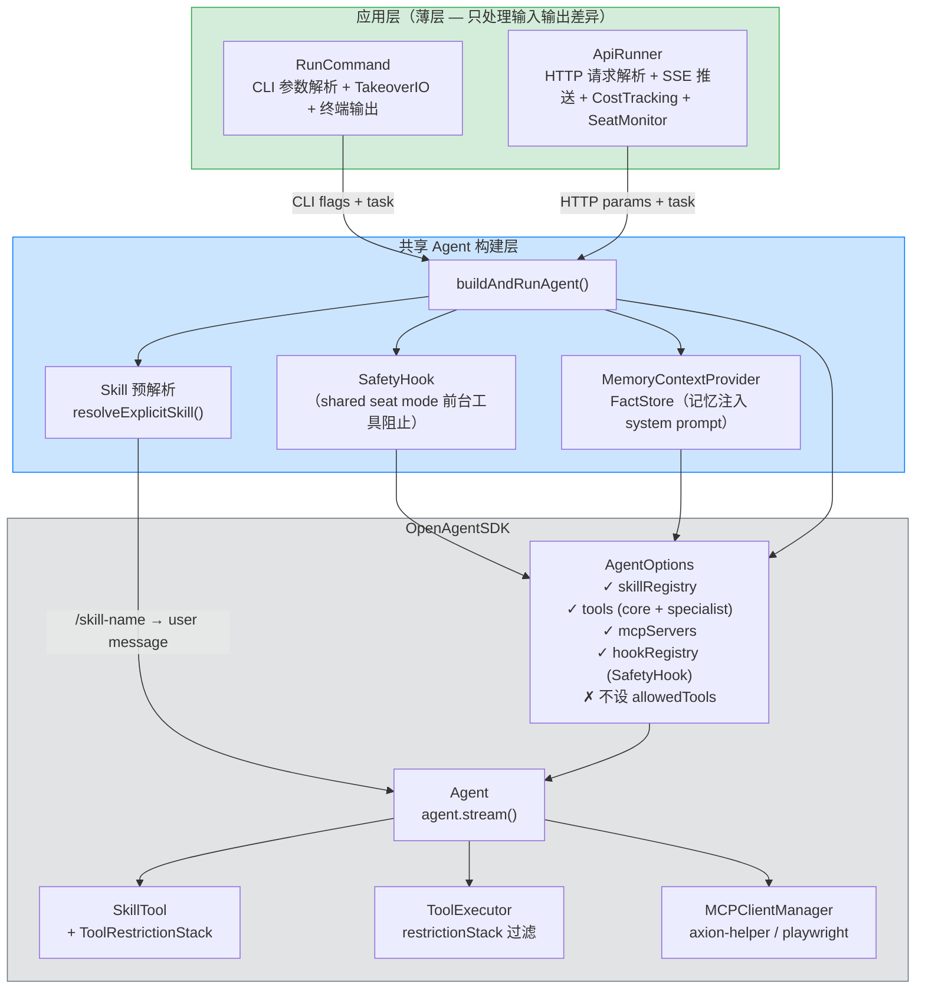

# Phase 6 重构架构对比

## 重构前（现状）



### 重构前问题清单

| # | 问题 | 位置 |
|---|---|---|
| 1 | RunCommand 和 AgentRunner 各 ~300 行重复代码 | RunCommand.swift / AgentRunner.swift |
| 2 | AgentRunner.runSkillAgent() 复制第三遍 | AgentRunner.swift:276-468 |
| 3 | Skill prompt 由应用层手动构建 | RunCommand:189-214, AgentRunner:301-333 |
| 4 | allowedTools 由应用层手动设置（过滤不生效） | RunCommand:243-246, AgentRunner:343-346 |
| 5 | 不传 skillRegistry → SDK 的 restrictionStack 永远 nil | RunCommand:254, AgentRunner:120/348 |
| 6 | Agent 名称与 SDK Agent 类冲突 | AgentRunner |
| 7 | RunEngine 全套死代码（11+ 文件） | Engine/ Executor/ Planner/ Verifier/ Output/ |
| 8 | runAgent() 不传 tools，SDK 没有注册任何工具 | AgentRunner:120-132 |

---

## 重构后



### 重构后职责划分

| 层 | 职责 | 不做什么 |
|---|---|---|
| **RunCommand** | CLI 参数解析、终端输出、TakeoverIO | 不构建 AgentOptions、不处理 skill prompt、不做 SafetyHook/Memory |
| **ApiRunner** | HTTP 请求解析、SSE 推送、结果持久化、CostTracking、SeatMonitor | 不构建 AgentOptions、不处理 skill prompt、不做 SafetyHook/Memory |
| **buildAndRunAgent()** | 加载配置、注册 skill、SafetyHook、Memory 注入、构建 AgentOptions、调 agent.stream() | 不做输出格式化（交给调用方） |
| **resolveExplicitSkill()** | 预解析 /skill-name、格式化为 user message | 不改 system prompt、不设 allowedTools |
| **SDK** | Agent loop、工具执行、Skill 生命周期、restrictionStack 过滤 | — |

### 重构后数据流

```
用户输入: "axion run /polyv-live-cli 获取频道信息"
         │
         ▼
┌─ RunCommand ──────────────────────────────┐
│ 1. 解析 CLI 参数                           │
│ 2. 调用 resolveExplicitSkill()            │
│    → 预解析 skill，生成 user message       │
│ 3. 调用 buildAndRunAgent(config, task, options) │
│ 4. 处理 stream 输出 → 终端打印             │
└───────────────────────────────────────────┘
         │
         ▼
┌─ buildAndRunAgent() ──────────────────────┐
│ 1. 加载配置、解析 API key                  │
│ 2. 注册 SkillRegistry                     │
│ 3. 构建 SafetyHook（shared seat mode）    │
│ 4. 加载 Memory 上下文注入 system prompt    │
│ 5. 构建 AgentOptions:                     │
│    - skillRegistry: registry   ✓          │
│    - tools: core + specialist  ✓          │
│    - mcpServers: {helper, pw}  ✓          │
│    - hookRegistry: SafetyHook  ✓          │
│    - allowedTools: nil         ✓(不设)     │
│ 6. createAgent(options)                   │
│ 7. 返回 agent + stream                    │
└───────────────────────────────────────────┘
         │
         ▼
┌─ SDK Agent Loop ──────────────────────────┐
│ 1. LLM 收到 user message（含 skill 预解析）│
│ 2. LLM 调用 SkillTool（如需）              │
│    → ToolRestrictionStack.push(["bash"])   │
│ 3. ToolExecutor 过滤：只允许 Bash          │
│ 4. LLM 调用 Bash → npx polyv-live-cli     │
│ 5. 返回结果                                │
└───────────────────────────────────────────┘
```
