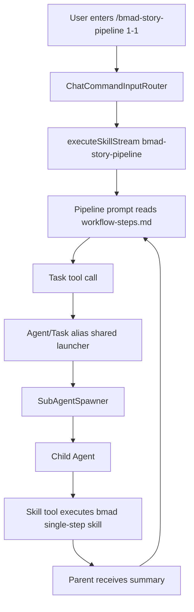

# Architecture

## Target Shape

目标是让 Claude Code skill 的 `Task(...)` 指令在 Axion 中有同名工具可用，并复用 SDK 已有 `Agent` 子代理能力。这里的 `Task` 不是新的 runtime 概念，而是 Claude Code 旧形状对 SDK `Agent` launcher 的 alias。



## Claude Code Parity Findings

本 spec 只追平当前 pipeline 必需的最小路径，但设计不能把 Claude Code 的 skill/subagent 能力简化成“prompt 注入”：

- Claude Code skill 是 `SKILL.md` 包，采用渐进加载；支持直接 `/skill-name` 触发，也支持 supporting files/scripts/templates/assets 按需读取。
- Claude Code/Agent SDK 的子代理主入口是 `Agent`，旧 `Task` 调用形状应被视为兼容 alias。
- Subagent 可以有 `tools` 限制、模型/提示覆盖、MCP server 配置和 skill 可见性；无 `tools` 限制时应继承父工具池，再过滤子代理 launcher。
- MCP 工具可能 upfront 加载，也可能通过 `ToolSearch` 延迟发现；`alwaysLoad` 是 Claude Code 用来避免关键 MCP 工具被延迟隐藏的机制。
- 因此 Axion 不能在 skill-only path 中固定移除 MCP/search/web/skill tools。正确做法是先组装一个可配置工具 profile，再按 dry-run、no-skills、permission、skill `allowed-tools` 和 subagent `tools` 过滤。

## Components

### 1. Agent/Task Subagent Launcher Alias

Expose `Task` as an alias of the SDK `Agent` launcher. In `open-agent-sdk-swift` 0.10.0 this is provided by `createTaskTool()`; Axion should consume that API rather than adding a local wrapper. Both public tool names use the same input shape and execution body:

```swift
struct TaskToolInput: Codable {
    let prompt: String
    let description: String
    let subagent_type: String?
    let model: String?
    let name: String?
    let maxTurns: Int?
}
```

Required behavior:

- Tool names are exactly `Agent` and `Task`.
- Required fields are `prompt` and `description`.
- `subagent_type` accepts `"general-purpose"` and any SDK-supported custom agent name.
- The tool delegates execution to `ToolContext.agentSpawner`.
- If no spawner exists, return a clear tool error naming the missing registration.
- The result includes the child agent text and tool names used if SDK exposes them.

SDK implementation:

- Refactor SDK `AgentTool` internals into a shared subagent launcher factory, then expose both `createAgentTool()` and `createTaskTool()`.
- Keep `Agent` for SDK-native/current Claude naming and `Task` for older Claude Code skill compatibility.

### 2. Spawner Detection and Child Tool Filtering

The SDK must treat `Agent` and `Task` as equivalent names for the same subagent launcher.

Required changes:

- `Agent.createSubAgentSpawner(...)` should return a spawner when the tool pool contains `Agent` or `Task`.
- `DefaultSubAgentSpawner.filterTools(...)` should remove both `Agent` and `Task` by default.
- Nested subagents remain a future opt-in capability, not default behavior.

Rationale:

- Registering only `Task` currently fails because spawner detection is hard-coded to tool name `Agent`.
- Registering both `Agent` and `Task` without child filtering lets child agents inherit `Task` and recurse.

### 3. Tool Profile and Skill/Subagent Filtering

Direct skill execution and Task child agents should use a shared tool selection policy, not hard-coded lightweight omissions.

Introduce a small pure planning helper such as `SkillExecutionToolProfile` or SDK-side equivalent:

```swift
struct SkillExecutionToolProfile {
    var baseTools: [ToolProtocol]
    var axionTools: [ToolProtocol]
    var mcpServers: [String: McpServerConfig]?
    var enableToolSearch: Bool
    var noSkills: Bool
    var dryrun: Bool
}
```

Required behavior:

- Normal chat and direct skill execution start from the same configured tool universe: SDK core tools, specialist tools where configured, Axion domain tools, `Skill`, `Agent`, `Task`, Web tools, MCP resource tools, and connected MCP tools.
- Dry-run removes side-effect tools such as `Bash`, `Write`, `Edit`, `Skill`, `Agent`, `Task`, storage execute tools, app uninstall execute tools, and non-read-only MCP tools.
- `--no-skills` disables `/skill-name` routing and `Skill` tool, but does not automatically disable generic `Agent`/`Task` subagents.
- `ToolSearch` is not globally impossible. Axion may keep it disabled by default for providers where it degrades reasoning, and provider/config policy is authoritative. Skill/subagent declarations may request `ToolSearch`, but they must not override user config, provider policy, dry-run, permission, or safety constraints.
- MCP servers from config are available to skill agents when the normal agent would have them, subject to permission mode and explicit MCP disable flags.
- Subagent `tools` and skill `allowed-tools` filter the assembled pool after deduplication, including MCP namespaced tools such as `mcp__server__tool`.
- Unknown `allowed-tools` entries are reported as unsupported entries; they must not silently turn the restriction into `nil`.

This policy fixes the current mismatch where skill-only execution has core tools only, no MCP servers, no `Skill`, no `Agent`/`Task`, and no `ToolSearch`.

### 4. Skill Command Guidance for Child Agents

Task child agents need an explicit instruction for slash-form skill execution:

```text
When a task prompt asks you to execute /<skill-name> <args>, invoke the Skill tool with
skill="<skill-name>" and args="<args>". Do not treat the slash command as plain chat text.
```

This instruction should be added to the parent agent system prompt when `Skill` and `Task` are both registered, or to the child agent system prompt in the subagent tool factory.

The child agent must inherit a working `Skill` tool from the parent tool pool. That is already true when:

- Axion registers `createSkillTool(registry:)` in the parent tool pool.
- `DefaultSubAgentSpawner` copies parent tools except subagent launchers.

In SDK 0.10.0, `DefaultSubAgentSpawner` receives and passes the parent `AgentOptions.skillRegistry`. Axion must set that option to the full discovered registry, not only the currently executing skill.

### 5. Direct Skill Package Context

Direct `executeSkillStream(skillName, args:)` must include filesystem skill package metadata when available.

Target prompt suffix:

```text
---
Skill package context:
- baseDir: /absolute/path/to/skill
- supportingFiles:
  - references/workflow-steps.md

Resolve bare supporting-file paths relative to baseDir. Read supporting files only when the
skill instructions require them.
```

Rules:

- Only append this block when `skill.baseDir != nil` or `supportingFiles` is non-empty.
- Keep it compact to avoid bloating every skill execution.
- Preserve existing `User request: <args>` behavior.
- Do not inline supporting file contents; progressive disclosure still requires the agent to read them on demand.

This solves the `references/workflow-steps.md` case without changing every existing SKILL.md to use Markdown links.

### 6. Axion Tool Registration Policy

Normal interactive and run agents:

- Register `Agent` and `Task` when not dry-run.
- Register `Task` as an alias whenever `Agent` is registered, unless a compatibility flag disables old Claude Code aliases.
- Keep `Skill` registration controlled by `noSkills`.
- If `noSkills == true`, Task still may be registered for general subagent work, but skill pipeline prompts cannot execute `/skill-name`; the child should report that skills are disabled.
- Do not hard-code `ToolSearch` exclusion as an Axion-wide rule. Keep a provider/config default if needed; skill/subagent declarations can opt in only when that policy allows it.

Skill-specific lightweight agents:

- Register `Task` for direct skill execution, because `/bmad-story-pipeline` enters `executeSkillStream`.
- Register `Skill` in lightweight agent when the executed skill may launch Task children that need single-step skills.
- Inherit MCP/Web/Search availability from the normal build profile unless config, dry-run, `allowed-tools`, or permission policy removes it.
- Use the full discovered `SkillRegistry`, not only a registry containing the currently executed skill, so orchestrator skills can invoke sub-skills.

Recommended MVP:

- Normal chat path: register `Agent`, `Task`, and `Skill` when allowed, with ToolSearch/MCP controlled by config.
- Direct lightweight skill path: use the same tool profile builder, then filter by the invoked skill's `allowed-tools`.
- Add a diagnostic when a skill/subagent requests a tool that is unavailable because of config, dry-run, no-skills, permission mode, or current SDK support.

### 7. Filesystem Subagent Definition Follow-up

Claude Code also supports filesystem subagent definitions under `.claude/agents/`. Axion's SDK already has `AgentDefinition`, including `tools`, `disallowedTools`, `mcpServers`, `skills`, and a system prompt, but current Axion usage only reaches the built-in definitions in `AgentTool.swift`.

MVP requirement:

- Do not block Task alias compatibility on filesystem subagent discovery.
- Preserve `subagent_type: "general-purpose"` behavior by falling back to parent model/default prompt.
- Record unsupported named subagent types clearly when no `AgentDefinition` exists.

Follow-up requirement:

- Add discovery for project/user `.claude/agents/*.md` or `.agents/agents/*.md`.
- Parse `name`, `description`, `tools`, `model`, `mcpServers`, and `skills`.
- Merge these definitions into the SDK subagent registry used by `Agent`/`Task`.

### 8. Progress and Error Contract

The parent output should remain compatible with existing SDK streaming:

- `Task` tool use appears as a normal tool use/progress event.
- `description` is surfaced in tool input preview.
- Tool result contains a compact child summary.
- If child execution fails, `Task` returns `isError: true`.
- The parent agent is responsible for stopping the pipeline because the skill prompt already instructs it to stop on step failure.

Error messages must include:

- Task description.
- Child prompt or extracted `/skill-name args`.
- Original child error.
- Suggested manual retry command when the prompt contains one.

## State and Permissions

No new persistent state is required for MVP.

Permission model:

- `Task` is not read-only.
- Parent permission mode is passed into child agent where SDK supports it.
- `dangerouslySkipPermissions` applies to child tools in the same way as parent tools.
- Session allowlist inheritance should follow current `canUseTool` callback behavior.

Budget model:

- Child agents consume normal model calls and tool turns.
- Existing `maxSteps` limits parent turn count; child `maxTurns` comes from Task input or SDK default.
- This spec does not introduce a separate child budget. If needed later, add a config field such as `subagentMaxTurns`.

## Compatibility Matrix

| Scenario | Expected behavior |
| --- | --- |
| `/bmad-story-pipeline 1-1` in chat | Direct skill execution; Task tool available; child can use Skill tool |
| `axion run /bmad-story-pipeline 1-1` if routed through skill runtime | Same as chat path, using lightweight skill agent support |
| Unknown `/xxx` in normal chat | Still passed to `agent.stream()` unchanged |
| Built-in slash command same name as skill | Built-in command still wins |
| dry-run | Task, Skill, Bash side-effect execution unavailable |
| `--no-skills` | `/skill-name` direct routing disabled; Task may exist but cannot execute skill commands |
| Child prompt asks `/missing-skill` | Child reports skill not found; parent pipeline stops |
| Skill references `references/file.md` as bare text | Direct skill prompt includes baseDir/supportingFiles so agent can resolve it |
