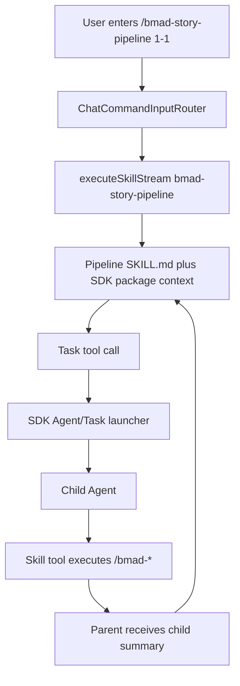

# Axion Epic 40: Run Claude Code/BMAD Workflow Skills End-to-End

> **状态：提议中**
> **优先级：P1**
> **前置依赖：** `open-agent-sdk-swift` 0.10.0+ / SDK Epic 29 (`../open-agent-sdk-swift/docs/epics/epic-29-claude-code-skill-subagent-compat.md`)
> **本 Epic 范围：** Axion runtime 集成、tool profile、slash skill guidance、BMAD pipeline 验收
> **目标入口：** 交互模式 `axion`、`axion run /skill-name ...`

## 背景与动机

Axion 已经支持发现 filesystem skills、展示 `/skills`，并能通过 `/skill-name args` 直接执行 skill。这个能力让 Axion 可以复用 Claude Code 生态中的 `SKILL.md` 包，但当前兼容还停留在“能加载 prompt”的阶段。

Claude Code workflow skill 常见写法会通过 `Task(...)` 派生子代理执行单步工作。经过拆分，`Task`/`Agent` alias、direct skill package context、工具声明兼容、subagent 默认过滤、child skill registry 继承、`mcpServers` 引用/子集过滤等通用 runtime 能力归入 SDK Epic 29，并已发布为 `open-agent-sdk-swift` 0.10.0。本 Epic 只保留 Axion 作为宿主必须完成的接入工作：

- 引用包含 SDK Epic 29 的本地 SDK 源码或发布版本。
- 在 Axion 普通 chat/run/direct skill agent 中注册 `Agent`、`Task`、`Skill` 等工具。
- 让 direct skill execution 不再使用过窄 lightweight tool pool。
- 让 skill-only path 继承 MCP、WebSearch/WebFetch、ToolSearch、Axion domain tools 等可用能力。
- 为 child agent 执行 `/bmad-*` skill 提供明确 system prompt guidance。
- 用小型 fixture 和真实 BMAD pipeline 验收端到端行为。

## 参考文档

本 Epic 从以下已有 spec 提取，不复制所有细节；实现时应继续查阅这些文件：

- `_bmad-output/specs/spec-task-subagent-skill-compat/SPEC.md`
- `_bmad-output/specs/spec-task-subagent-skill-compat/brownfield-analysis.md`
- `_bmad-output/specs/spec-task-subagent-skill-compat/architecture.md`
- `_bmad-output/specs/spec-task-subagent-skill-compat/implementation-plan.md`
- `_bmad-output/specs/spec-task-subagent-skill-compat/test-plan.md`

SDK 前置 Epic：

- `../open-agent-sdk-swift/docs/epics/epic-29-claude-code-skill-subagent-compat.md`

Readiness 评审：

- `_bmad-output/planning-artifacts/implementation-readiness-report-2026-06-14.md`

外部机制参考：

- Claude Code Skills: `https://code.claude.com/docs/en/skills`
- Claude Code Subagents: `https://code.claude.com/docs/en/sub-agents`
- Claude Agent SDK Subagents: `https://code.claude.com/docs/en/agent-sdk/subagents`
- Claude Code MCP: `https://code.claude.com/docs/en/mcp`

## 产品目标

1. **可运行 Claude Code/BMAD workflow skill**：用户可以在 Axion 中运行 `/bmad-story-pipeline ...` 这类 workflow skill，并看到子任务按顺序执行。
2. **复用 SDK runtime**：Axion 不复制 `AgentTool`、`SubAgentSpawner`、`SkillTool` 逻辑，只负责工具组装、权限策略和用户输出。
3. **支持 skill 编排 skill**：子代理收到 `Execute /skill-name args` 时能通过 `Skill` tool 执行对应 skill。
4. **保留完整工具语义**：direct skill agent 不因 lightweight path 默认失去 MCP、Web、search、domain tools。
5. **权限行为一致**：dry-run、`--no-skills`、permission mode、tool allowlist、session allowlist 在普通 agent、skill agent、child agent 中有明确一致的策略。
6. **可观察和可测试**：用户能看到子任务开始、完成、失败和摘要；开发验证有单元测试和 fixture 验收路径。

## 非目标

- 不在 Axion 实现 SDK Epic 29 的公共 runtime 能力。
- 不实现完整 workflow/DAG 引擎；只兼容 Claude Code skill 中的 `Task`/`Agent` 子代理模式。
- 不实现 background subagent、resume subagent、worktree isolation、team coordination 的完整语义；这些由 SDK deferred diagnostics 标明。
- 不实现完整 `.claude/agents/*.md` 管理 UI、agent marketplace 或 subagent 文件热加载。
- 不硬编码 BMAD 旧命令名到新命令名的映射；旧命令兼容通过 skill aliases 或 skill 包同步解决。
- 不让宿主层静态解析并执行 `Task(...)` 文本块；执行仍由模型通过 tool call 完成。
- 不改变现有 `/skill-name args` routing：built-in slash command 优先，skill 匹配第二，未知 `/xxx` 透传普通 agent。

## 当前代码事实

### 已具备

- `ChatCommandInputRouter` 已能把 `/skill-name args` 路由到 skill execution path。
- `ChatCommand` 使用 `agent.executeSkillStream(skillExec.name, args: skillExec.args)` 执行匹配到的 skill。
- 未匹配的 `/xxx` 会继续传给普通 agent，不再直接报未知命令。
- SDK 已有 `Agent` tool、`SubAgentSpawner`、`SkillTool`、`SkillRegistry`、`SkillLoader` 和 direct `executeSkillStream`。
- `SkillLoader` 会保存 filesystem skill 的 `baseDir`、`supportingFiles` 和 `promptTemplate`。
- SDK 0.10.0 已支持 `Task` alias、`AgentToolInput.skills`、`AgentToolInput.mcpServers`/`mcp_servers`、child skill registry 继承和 MCP server tool subset 过滤。
- Axion `Package.swift` 当前仍是 `from: "0.8.0"`，`Package.resolved` 当前 pin 到 `0.8.3`；Story 40.1 必须升到 `0.10.0` 并重新 resolve。

### Axion 当前缺口

- 普通 agent 工具池没有注册 `createAgentTool()` / `createTaskTool()`。
- `buildSkillAgent()` 只注册当前 skill 到 registry，编排型 skill 看不到其他 discovered skills。
- `buildSkillAgent()` 只给 core tools，排除 `ToolSearch` 和 `AskUser`，不含 MCP servers、`SkillTool`、Memory、specialist tools、`Agent/Task`。
- dry-run、`--no-skills`、permission mode、MCP read-only/side-effect policy 在普通 agent 与 skill agent 之间没有统一 profile。
- 父/子 system prompt 没有明确说明 `Execute /<skill-name> <args>` 应调用 `Skill` tool。
- SDK unsupported/deferred diagnostics 是否展示给 Axion 用户尚未定义。
- BMAD `bmad-story-pipeline` 的本机 skill 包需要与当前 `/bmad-*` 命令名保持同步。

## SDK Readiness Gate

Story 40.2 及之后的 Axion 实现不得在 SDK gate 未满足时开始。当前 gate 的最低发布版本是 `open-agent-sdk-swift` 0.10.0（commit `4285aac6535236dae014e945eed694ed7fe6bd4b`）。

### MVP Gate: 必须先完成

来自 SDK Epic 29：

- Story 29.1：`createTaskTool()` 已导出，工具名为 `Task`，行为等价于 `Agent`。
- Story 29.2：`Agent.createSubAgentSpawner(...)` 能在工具池包含 `Agent` 或 `Task` 时注入 spawner。
- Story 29.2：`DefaultSubAgentSpawner` 默认过滤 `Agent` 和 `Task`，避免 child agent 默认递归派生。
- Story 29.3：direct `executeSkillStream` prompt 包含 filesystem skill package context。
- Story 29.7：上述行为有 SDK 测试覆盖，并且 SDK full test suite 通过。

### Policy/Diagnostics Gate: 完成后才能验收全部能力

来自 SDK Epic 29：

- Story 29.4：`allowed-tools` 能保留 MCP/custom/raw tool names。
- Story 29.5：skill `allowed-tools` 与 subagent `tools` / `disallowedTools` 使用同一过滤语义。
- Story 29.6：background/resume/isolation/team 等 runtime controls 有 deferred diagnostics；`skills` 和可解析 MCP references 已在 SDK 0.10.0 wiring，无法解析的 MCP reference 仍产生 diagnostics。

若 Axion 尚未 resolve 到 SDK 0.10.0+，可以实现基础 pipeline 草案，但不得宣称 MCP/custom tool restriction parity、child skill registry 继承、MCP reference/subset 过滤或 deferred diagnostics 完成。

### Gate Acceptance Criteria

**Given** Axion 使用本地 `../open-agent-sdk-swift`
**When** 编译 Axion
**Then** `createAgentTool()`、`createTaskTool()`、`createSkillTool(registry:)` 都可 import 并注册

**Given** Axion direct 执行 filesystem skill
**When** skill 有 `baseDir` 和 `supportingFiles`
**Then** SDK 生成的 skill prompt 包含 package context

**Given** Axion 尚未使用 SDK 0.10.0+
**When** Axion stories 进入验收
**Then** MCP/custom tool restriction parity 和 deferred diagnostics 只能标记为 deferred，不能算 Epic 40 完成

## 目标架构



核心原则：

- SDK owns `Agent`/`Task` launcher semantics。
- Axion owns tool universe assembly and policy。
- 普通 chat/run、direct skill、child agent 使用同一套 Axion tool profile，再按模式过滤。
- 子代理默认继承父工具池，但 SDK 默认移除 `Agent` 和 `Task`，避免递归。
- `Skill` tool 和 `AgentOptions.skillRegistry` 需要由 Axion 填入完整 discovered registry；SDK 0.10.0 会把 child registry 继承给子代理，让 `/bmad-*` 单步 skill 可以被执行。
- MCP server refs 和 `{ name, tools }` 子集过滤由 SDK 0.10.0 执行；Axion 负责把 normal/direct skill agent 的 MCP config 和 MCP tool pool 放进同一 tool profile。

## Story 40.1: SDK Runtime Readiness Gate

As an Axion maintainer,
I want a deterministic gate proving SDK Epic 29 runtime support is available,
So that Axion integration work does not start on missing or unstable SDK APIs.

**类型：** Enabling story / dependency gate.

**实施：**

1. 在 `../open-agent-sdk-swift` 完成 SDK Epic 29 MVP Gate。
2. 将 Axion `Package.swift` 的 `open-agent-sdk-swift` 最低版本升到 `0.10.0`，并更新 `Package.resolved`。
3. 新增或更新一个编译级/单元级测试，验证 Axion 可引用 `createAgentTool()`、`createTaskTool()`、`createSkillTool(registry:)`。
4. 验证 direct `executeSkillStream` 已由 SDK 注入 skill package context。
5. 在 Story 40.1 completion note 中记录 SDK version `0.10.0` 和 commit `4285aac6535236dae014e945eed694ed7fe6bd4b`。

**Acceptance Criteria：**

**Given** Axion 使用本地 `../open-agent-sdk-swift`
**When** 运行 Axion 编译或相关单元测试
**Then** `createTaskTool()` 可用
**And** `Task` tool 的 schema 与 `Agent` 兼容
**And** `Task`/`Agent` tool schema 包含 `skills` 与 `mcpServers`

**Given** filesystem skill 包含 supporting files
**When** Axion 通过 `executeSkillStream(skillName,args:)` 执行该 skill
**Then** skill prompt 包含 SDK package context

**Given** Axion 未 resolve 到 SDK 0.10.0+
**When** 评估 Epic 40 进度
**Then** 相关 Axion stories 必须标记为 blocked/deferred，不能关闭整个 Epic

## Story 40.2: Shared Tool Profile Helper With Behavior Parity

As an Axion runtime maintainer,
I want a shared tool profile builder that preserves current chat/run behavior,
So that later stories can add skill/subagent tooling without duplicating tool assembly logic.

**实施：**

1. 从 `AgentBuilder.build()` 提取可复用 Axion tool profile helper。
2. helper 先复刻当前普通 chat/run 工具集合，不在本 story 引入新工具行为。
3. 保持 `build()`、`buildSkillAgent()` 的现有可见行为，除非后续 story 明确修改。
4. 为 profile 增加可测试的工具名检查输出，例如返回 `[ToolProtocol]` 或 debug metadata。
5. 添加单元测试覆盖普通 chat/run 非 dry-run 与 dry-run 的工具集合 parity。

**Acceptance Criteria：**

**Given** 当前普通 chat/run agent 构建
**When** 切换到 shared tool profile helper
**Then** 已有工具集合保持等价
**And** 现有单元测试通过

**Given** dry-run 模式
**When** 使用 shared tool profile helper
**Then** 当前 dry-run 工具过滤行为保持不回退

## Story 40.3: Register `Agent` / `Task` / `Skill` Across Agent Paths

As a Claude Code workflow skill user,
I want Axion agents to expose `Agent`, `Task`, and `Skill` tools consistently,
So that workflow skills can spawn child agents and invoke other skills.

**实施：**

1. 普通 chat/run agent 非 dry-run 时注册 `createAgentTool()` 和 `createTaskTool()`。
2. direct skill agent 非 dry-run 时注册 `createAgentTool()`、`createTaskTool()`、`createSkillTool(registry:)`。
3. `--no-skills` 禁用 `/skill-name` routing 和 `Skill` tool，但不自动禁用 generic `Agent/Task`。
4. dry-run 移除 `Skill`、`Agent`、`Task`，避免 side-effect 或额外 LLM 子调用。
5. 添加单元测试覆盖 chat/run/direct skill 三条路径的 tool names。

**Acceptance Criteria：**

**Given** 普通 chat agent 非 dry-run 构建
**When** 检查工具名
**Then** 包含 `Agent` 和 `Task`
**And** `Skill` 是否存在受 `--no-skills` 控制

**Given** direct skill agent 非 dry-run 构建
**When** 检查工具名
**Then** 包含 `Skill`、`Agent`、`Task`

**Given** dry-run 模式
**When** 构建普通 agent 或 skill agent
**Then** `Skill`、`Agent`、`Task` 不出现在可用工具池中

## Story 40.4: Direct Skill Uses Discovered Skill Registry

As a BMAD pipeline user,
I want a direct skill execution to see other discovered skills,
So that a pipeline skill can delegate to `/bmad-create-story` and other single-step skills.

**实施：**

1. `buildSkillAgent()` 使用 discovered `SkillRegistry`，不是只注册当前 skill。
2. `createSkillTool(registry:)` 使用同一个 discovered registry。
3. `AgentOptions.skillRegistry` 使用同一个 discovered registry，让 SDK child registry inheritance 生效。
4. skill alias resolution 与 `/skill-name args` direct routing 保持一致。
5. 如果 child agent 找不到 skill，错误必须保留原 skill 名和 args。
6. 添加 fixture skills：`pipeline-test`、`step-one`、`step-two`，用于确定性验证 registry 可见性。

**Acceptance Criteria：**

**Given** registry 中有 `pipeline-test`、`step-one`、`step-two`
**When** direct 执行 `/pipeline-test demo`
**Then** pipeline child agent 能通过 `Skill` tool 找到 `step-one` 和 `step-two`

**Given** child prompt 包含 `/missing-skill demo`
**When** skill registry 中没有该 skill
**Then** 子代理返回明确错误
**And** 错误包含 `missing-skill` 和原始 args `demo`

## Story 40.5: MCP/Web/Search Tool Inheritance Policy

As a skill author,
I want direct skill agents to inherit allowed MCP, Web, and search tools,
So that skill execution does not silently lose capabilities compared with normal chat/run.

**实施：**

1. shared tool profile 覆盖 MCP resource tools、connected MCP tools、WebSearch、WebFetch、ToolSearch。
2. `ToolSearch` 从 hard-coded exclusion 改为 provider/config policy；GLM 默认可继续关闭。skill/subagent 显式声明 `ToolSearch` 只能作为 opt-in request，不能覆盖用户配置、provider policy、dry-run、permission 或安全策略。
3. skill agent 按同一 profile 继承 MCP/Web/Search availability，除非 config、dry-run、permission 或 tool restrictions 移除。
4. 非 read-only MCP/custom tools 在 dry-run 或禁止写入模式中必须被过滤。
5. `mcpServers` 引用和 `{ name, tools }` 子集过滤交给 SDK 0.10.0；Axion 测试应验证 parent options/tool pool 中的 MCP config 和 connected tools 被传入 SDK。
6. 添加单元测试覆盖 MCP namespaced tool、Web tools、ToolSearch 的可用性和过滤。

**Acceptance Criteria：**

**Given** skill 需要 WebSearch、WebFetch、ToolSearch 或 MCP tool
**When** config 和 permission 允许
**Then** skill agent 能获得这些工具
**And** 不因为 direct skill lightweight path 被静默移除

**Given** provider/config 禁用了 `ToolSearch`
**When** skill 或 subagent 声明 `ToolSearch`
**Then** Axion 不强制启用 `ToolSearch`
**And** tool availability diagnostics 或 verbose logs 能解释该 request 被策略禁用

**Given** dry-run 模式
**When** MCP/custom tool 不是 read-only
**Then** 该工具不会出现在 direct skill agent 或 child agent 工具池中

## Story 40.6: Permission, Allowlist, and Diagnostics Consistency

As an Axion user,
I want permission decisions and diagnostics to behave consistently across parent, skill, and child agents,
So that workflow skills do not bypass approvals or hide unsupported behavior.

**实施：**

1. 定义 session allowlist 行为：父 session 已允许的 tool name/pattern 可被 direct skill agent 和 child agent 继承，但不得扩大到未批准工具。
2. permission mode 在 ordinary agent、direct skill agent、child agent 中一致传递。
3. `allowed-tools` 或 subagent tool restrictions 先收窄工具集合，再应用 session allowlist/permission policy。
4. SDK deferred/unsupported diagnostics 必须在 Axion terminal output 或 verbose logs 中可见。
5. diagnostics 不应被当作成功摘要吞掉；如果影响 tool availability，应显示为 warning 或 tool result error。

**Acceptance Criteria：**

**Given** session allowlist 只允许 `Read` 和 `Grep`
**When** direct skill agent 或 child agent 构建工具池
**Then** 不会继承 `Write`、`Edit`、`Bash` 或 side-effect MCP tools

**Given** SDK 返回 unsupported/deferred diagnostics
**When** Axion 输出 tool result 或 progress
**Then** 用户能看到相关 warning 或 error

**Given** skill `allowed-tools` 收窄为只读工具
**When** session allowlist 包含更多工具
**Then** 最终工具池仍只包含 skill restriction 允许的工具

## Story 40.7: Slash Skill Guidance for Child Agents

As a BMAD pipeline skill user,
I want child agents to call `Skill` when they see `Execute /skill-name args`,
So that pipeline steps execute corresponding skills instead of treating slash commands as plain text.

**实施：**

1. 当 `Skill` 和 `Agent/Task` 同时可用时，在父/子 system prompt 中加入 slash skill guidance。
2. guidance 明确：`Execute /<skill-name> <args>` 应调用 `Skill` tool，参数为 `skill` 和 `args`。
3. 确认 SDK `DefaultSubAgentSpawner` 复制父工具池时保留 `Skill` tool，并继承 `AgentOptions.skillRegistry`。
4. Axion 创建 parent/direct skill agent 时必须把完整 discovered registry 设置到 `AgentOptions.skillRegistry`，否则子代理无法获得完整 skill 可见性。
5. 添加确定性单元测试覆盖 prompt guidance 文本和工具可用性；LLM 行为只作为手工验收补充。

**Acceptance Criteria：**

**Given** child prompt 包含 `Execute /bmad-create-story 1-1 yolo`
**When** 子代理运行且 `Skill` tool 可用
**Then** prompt guidance 明确要求调用 `Skill(skill: "bmad-create-story", args: "1-1 yolo")`

**Given** child prompt 包含 `/missing-skill demo`
**When** skill registry 中没有该 skill
**Then** 子代理返回明确错误
**And** 父 pipeline 停止在失败 step
**And** 输出可手动重试的命令或修复建议

## Story 40.8: Child Task Progress, Failure, and Summary Output

As an interactive Axion user,
I want pipeline execution to show each child task's start, completion, failure, and summary,
So that long workflows do not look stuck and failures are actionable.

**实施：**

1. 保持 `Task`/`Agent` tool use 走现有 SDK streaming event。
2. tool input preview 中显示 `description`。
3. tool result 包含 child agent 文本摘要。
4. 如果 child result 是 error，`Task` 返回 `isError: true` 并保留 child error text。
5. 如果 prompt 中能提取 slash skill command，失败信息中包含该命令。
6. 默认复用现有 `SDKMessage.toolUse`、`toolProgress`、tool result 输出；只有不足时再新增 formatter branch。
7. compact mode 不应重复打印大段 child prompt；verbose/debug mode 可显示更多 tool detail。

**Success Output Example：**

```text
[Task] Create story
  command: /bmad-create-story 1-1 yolo
  status: running

[Task] Create story
  status: completed
  summary: Story draft created and saved.
```

**Failure Output Example：**

```text
[Task] Create story
  command: /missing-skill demo
  status: failed
  error: Skill "missing-skill" not found or not registered
  retry: /missing-skill demo
```

**Acceptance Criteria：**

**Given** pipeline 有 5 个 Task step
**When** 用户运行 `/bmad-story-pipeline 1-1`
**Then** 终端至少显示每个 step 的 description、执行命令、完成状态
**And** compact output 不重复打印完整 child prompt

**Given** 第 3 个 step 失败
**When** 父 agent 收到 tool error
**Then** pipeline 停止
**And** 输出失败 step、原始错误、可手动重试命令

## Story 40.9: Fixture-Based Pipeline Acceptance

As an Axion maintainer,
I want a deterministic small pipeline fixture,
So that we can verify the workflow mechanics without relying on a real BMAD long-running flow.

**实施：**

1. 准备 fixture skills：`pipeline-test`、`step-one`、`step-two`。
2. fixture pipeline 使用 `Task`/`Agent` 子代理依次执行两个 step skills。
3. fixture 覆盖 success path、missing skill failure path、dry-run filtering path。
4. fixture 测试必须可在无 API key 时跳过 LLM-dependent path，单元层仍验证 registry/profile/prompt guidance。
5. 如果需要 E2E，放在 `Tests/AxionE2ETests/Interactive/`，默认开发验证不运行。

**Acceptance Criteria：**

**Given** fixture skills 已安装到测试 registry
**When** 执行 `/pipeline-test demo`
**Then** 子代理按顺序请求 `step-one` 和 `step-two`

**Given** fixture pipeline 的第二步引用 missing skill
**When** 执行 fixture
**Then** pipeline 停止在第二步
**And** 输出缺失 skill 名称和可重试命令

## Story 40.10: Local BMAD Pipeline Manual Verification

As an Axion/BMAD user,
I want the real `bmad-story-pipeline` skill package to work in my local Axion setup,
So that the Epic proves value against the actual workflow that motivated it.

**实施：**

1. 验证 `~/.agents/skills/bmad-story-pipeline/SKILL.md` 和 `references/workflow-steps.md` 使用同一套当前 BMAD 命令名。
2. 不在 Axion 中硬编码 `/bmad-bmm-*` 到 `/bmad-*` 的映射。
3. 需要旧命令兼容时，通过 skill aliases 或同步 skill 包解决。
4. 准备手工验收：真实 `/bmad-story-pipeline 1-1`，需要 API key 和已安装单步 BMAD skills。
5. 手工验收记录 SDK commit/hash、Axion commit/hash、skill package 路径和关键输出。

**Acceptance Criteria：**

**Given** 本机 `bmad-story-pipeline` 的 `SKILL.md` 和 workflow reference 都使用 `/bmad-create-story` 等当前命令
**When** 用户运行 `/bmad-story-pipeline 1-1`
**Then** pipeline 依次派生 `Task`/`Agent` 子代理执行各单步 skill

**Given** 本机 skill 仍引用旧 `/bmad-bmm-*` 或 `/bmad-tea-*` 命令
**When** child agent 执行旧命令
**Then** Axion 不做硬编码映射
**And** 错误提示保留缺失 skill 名称并建议同步 skill 包或添加 aliases

## Story 间依赖关系

```text
SDK Epic 29 MVP Gate
  |
  +--> 40.1 SDK Runtime Readiness Gate
          |
          +--> 40.2 Shared Tool Profile Helper With Behavior Parity
                  |
                  +--> 40.3 Register Agent/Task/Skill Across Agent Paths
                          |
                          +--> 40.4 Direct Skill Uses Discovered Skill Registry
                                  |
                                  +--> 40.5 MCP/Web/Search Tool Inheritance Policy
                                          |
                                          +--> 40.6 Permission, Allowlist, and Diagnostics Consistency
                                                  |
                                                  +--> 40.7 Slash Skill Guidance for Child Agents
                                                          |
                                                          +--> 40.8 Child Task Progress Output
                                                                  |
                                                                  +--> 40.9 Fixture Acceptance
                                                                          |
                                                                          +--> 40.10 Local BMAD Manual Verification
```

Notes:

- Story 40.5 and 40.6 require Axion to resolve SDK 0.10.0+ for full completion.
- Story 40.10 is manual verification and should not be the only proof of correctness.

## 默认测试策略

开发完成后只运行 Axion 项目定义的单元测试范围，不运行集成测试或 E2E：

```bash
swift test --filter "AxionHelperTests.Tools" --filter "AxionHelperTests.Models" --filter "AxionHelperTests.MCP" --filter "AxionHelperTests.Services" --filter "AxionCoreTests" --filter "AxionCLITests"
```

如果同一 story 修改了本地 `open-agent-sdk-swift`，需要先在 SDK 仓库按 SDK 规则运行完整 test suite，并报告总测试数；再回到 Axion 运行上述单元测试。

E2E 只作为可选验收，放在 `Tests/AxionE2ETests/Interactive/`，没有 API key 时必须跳过。

## 手工验收

**前置条件：**

- API key 已配置。
- Axion 已 resolve 到 `open-agent-sdk-swift` 0.10.0+。
- Axion 能看到 `bmad-story-pipeline` 和单步 BMAD skills。
- `~/.agents/skills/bmad-story-pipeline/SKILL.md` 与 `references/workflow-steps.md` 命令名一致。

**步骤：**

1. 运行 `axion`。
2. 输入 `/skills`，确认 pipeline 和单步 BMAD skills 可见。
3. 输入 `/bmad-story-pipeline 1-1`。
4. 确认第一步通过 `Task`/`Agent` 子代理执行 `/bmad-create-story 1-1 yolo`。
5. 确认第一步完成后才进入第二步。
6. 在 fixture 中制造 missing skill，确认 pipeline 停止并输出缺失命令名。

**预期：**

- 每个子任务都有可见 tool use/progress。
- child summary 返回父 agent。
- 任一步失败会停止 pipeline。
- supporting file 路径从 skill package baseDir 解析，不依赖当前工作目录。
- MCP/Web/Search 工具可用性由 Axion profile 和 permission policy 决定，不被 direct skill path 静默移除。
- SDK unsupported/deferred diagnostics 在 Axion 输出或 verbose logs 中可见。

## 风险与缓解

| 风险 | 缓解 |
| --- | --- |
| Axion 引用的 SDK 版本不含 `Task` alias / `skills` / `mcpServers` wiring | Story 40.1 强制升到 SDK 0.10.0+ 并做 compile/test gate |
| Story 40.2 重新变成大而全 refactor | 保持 40.2 只做 parity helper；新增行为放到 40.3-40.6 |
| 模型继续打印 `Task(...)` 而不是调用 tool | tool 名精确为 `Task`；system prompt 明确 Claude Code Task snippet 映射到 `Task` tool |
| child agent 把 `/skill` 当普通文本 | 增加 slash skill guidance，并继承 `Skill` tool |
| dry-run 暴露副作用工具 | Story 40.3/40.6 明确移除 `Skill`、`Agent`、`Task` 和 side-effect tools |
| MCP/search 被 skill-only path 静默移除 | Story 40.5 让 normal 和 skill agent 共享 tool profile |
| `allowed-tools` 未知项变成无限制 | SDK 0.10.0 diagnostics + Axion 不绕过 diagnostics |
| 旧 BMAD 命令名失败 | 通过 skill 包同步或 aliases 修复，不在 Axion 硬编码映射 |
| 真实 BMAD 流程依赖环境导致验收不稳定 | Story 40.9 先提供 fixture acceptance；Story 40.10 作为手工验收 |

## 延后项

以下内容不阻塞本 Epic 的 BMAD pipeline MVP，但需要保留为后续 Claude Code parity 工作：

1. 加载 `.claude/agents/*.md` 或 `.agents/agents/*.md` filesystem subagent definitions。
2. background/resume/isolation/team semantics。
3. skill listing budget、visibility overrides、`disable-model-invocation` 等大规模 skill library 体验。
4. MCP `alwaysLoad` 配置和 individual tool `_meta` 支持。
